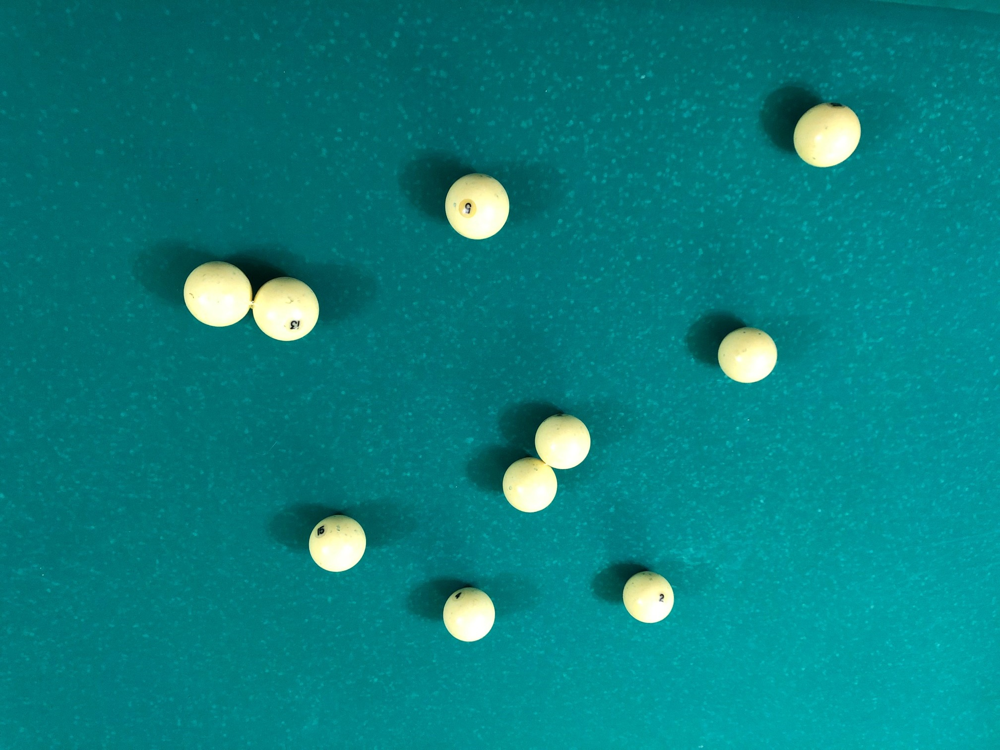
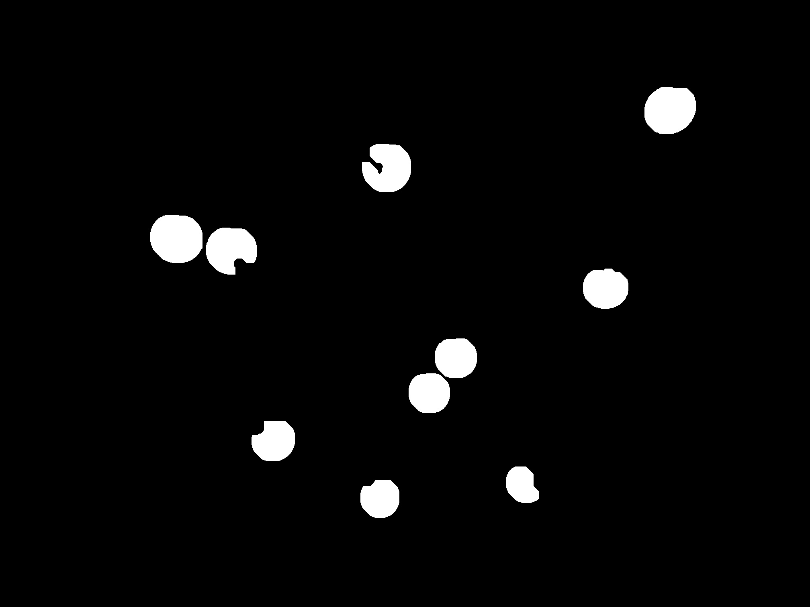
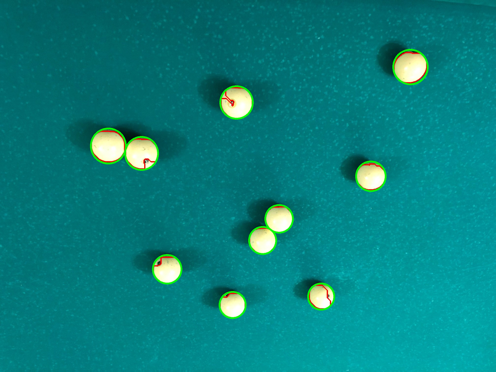

# Overview

* Initial image


* Image after finding contours of each ball
 

* Image with circles and contours


* Logs:
```python
Found 10 different balls
Mean radius 61.35030975341797
Var radius 43.26559472140274
```